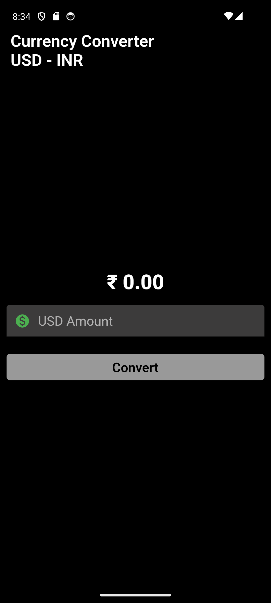
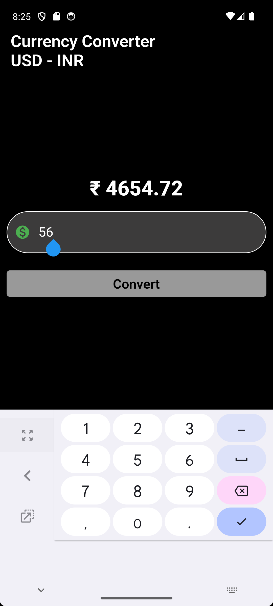

# Currency Converter App

**Currency Converter App** is a Flutter-based mobile application designed for currency conversion, specifically converting US Dollars to Indian Rupees. The app boasts a clean Material Design interface, real-time exchange rates, and a user-friendly experience.

## Features

- **Real-time Exchange Rates:** Accurate and up-to-date conversion rates for seamless currency conversion.
- **Intuitive Design:** Material Design principles ensure an intuitive and visually appealing user interface.
- **Responsive:** The app is optimized for various screen sizes, providing a consistent experience across devices.

## App Preview

## Contributing

To contribute to the project, 
- Contribute for the **cupertino design**.
- Please open an issue first to discuss your proposed changes.

## Author

By Karan Upadhyay
